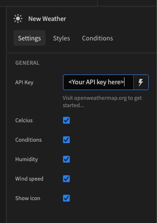
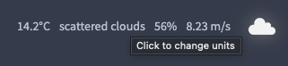
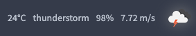

# Weather
A budibase plugin that displays local weather information based on the opeweathermap.org API

# Description
A configureable custom component that shows the current weather local to the user, with properties such as temperature, wind-speed, condtions, and humidity.

Head to [https://openweathermap.org/api](https://openweathermap.org/api) to get an API key, then paste it into the settings of the component.



_Click the component to change units_



_See a wide range of icons_




## Instructions

To build your new  plugin run the following in your Budibase CLI:
```
budi plugins --build
```

You can also re-build everytime you make a change to your plugin with the command:
```
budi plugins --watch
```

# weather
